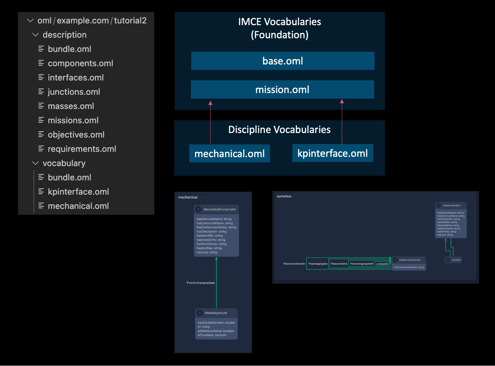
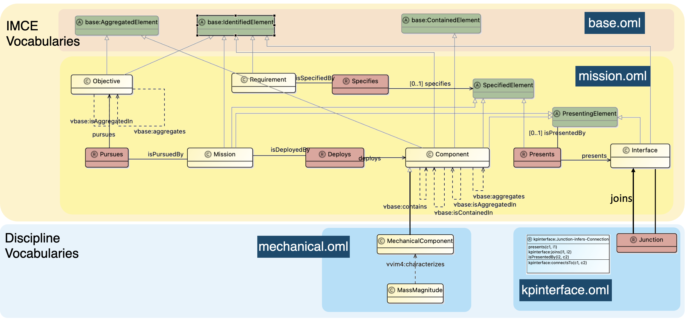
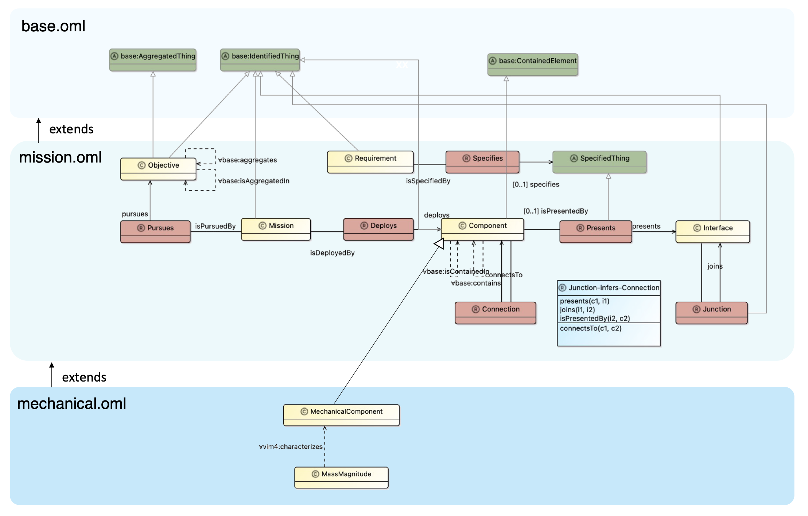

# OML Kepler 16b example with IMCE Vocabularies

 

This is a reformulated OML model of [kepler16b-example](https://github.com/opencaesar/kepler16b-example) using the [IMCE Vocabularies](https://github.com/opencaesar/imce-vocabularies).
This is a demonstration of the modular approach in OML Vocabulary usage.

For details, check this [tutorial](http://www.opencaesar.io/oml-tutorials/#tutorial2).

## Stand on the shoulders of giants

### Modular Vocabulary stacks of Kepler-16b model

### IMCE Vocabularies as foundations and Discipline Vocabularies

[mechanical.oml](./src/oml/example.com/tutorial2/vocabulary/mechanical.oml) and [kpinterface.oml](./src/oml/example.com/tutorial2/vocabulary/kpinterface.oml) extend [IMCE mission.oml](https://github.com/opencaesar/imce-vocabularies/blob/master/src/oml/imce.jpl.nasa.gov/foundation/mission.oml).

## Original Kepler-16b Vocabularies

