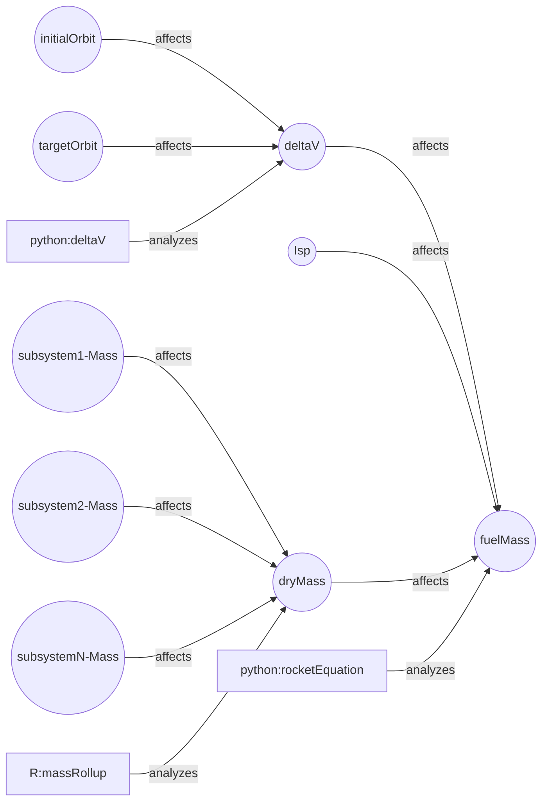

# Orbital Analysis Integrations

The goal of this branch is to demonstrate the integration of the mathematical analysis with the OML descriptive model by using the COTS python orbital dynamics tools.

## Here is a minimum set of state variables

### Circles refer to the state variables
### Squares refer to the analysis vocab

## analysis:Characterizes

We need a description that configures the set of analysis codes or tools that calcurate the deltaV and fuelMass.

# Proposed Workflow

1. Specifies the Analysis Configurations.
    - Query the configuration of the spacecraft.
    - Query the configuration of the analysis tools.
    - Query the state variables in terms of goals

2. Run Simulations
    - track the status of pipeline flows
    - dashboard of simulation parameters
    - dashboard of simulation results

3. Reflect simulation results to the oml model
    - update state variables

# Step

1. First, without scenario to simplify the sa vocabularies.

2. Modeling state variables

3.  Build actual workflow using quarto.

    - case-A: Using astropy to calcurate dV and fuelMass.
    - case-B: Using R to calcurate dV and fuelMass. 

4. 

 
